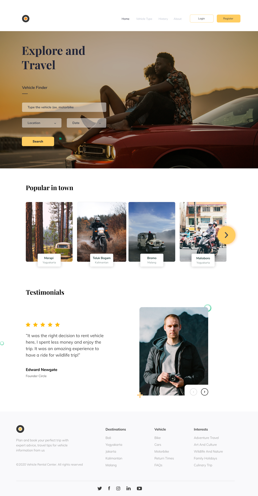
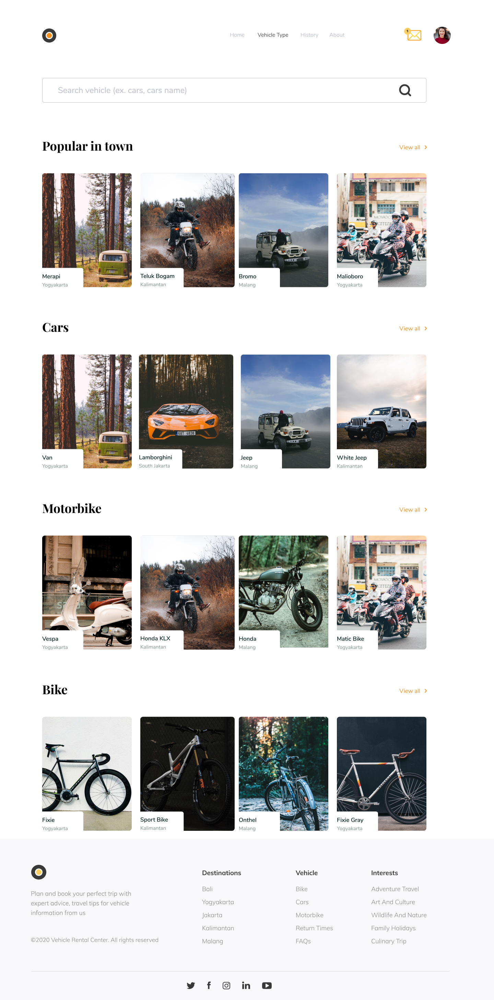
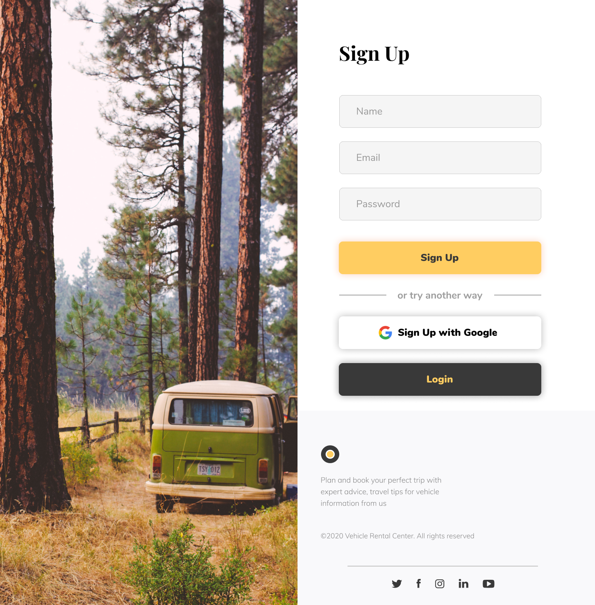

# Vehicle Rental

Vehicle Rental is a two-sided marketplace app for renting vehicles. The primary feature is consumers can rent vehicles while renters can offer their vehicles for rent. This Web App was built using ReactJS and Redux for state management.

## 🔥 Showcase

- [RESTful API Repository](https://github.com/rfauzi44/vehicle-rental-api)
- Web Screenshot
<p float="left">



</p>

## 💻 Built with

- [ReactJS](https://github.com/facebook/react) for frontend framework
- [create-react-app](https://github.com/facebook/create-react-app) for generate project boilerplate
- [Redux (with persist) ](https://github.com/reduxjs/react-redux) for state management
- [Axios](https://github.com/axios/axios) for handling requests and responses to API

## 🛠️ Installation Steps

1. Clone the repository

   ```bash
   git clone https://github.com/rfauzi44/vehicle-rental-web.git
   ```

2. Install dependencies

   ```bash
   npm install
   ```

3. Add .env file at root folder project

   ```sh
   REACT_APP_BASE_URL = Your Backend API
   ```

4. Run the app

   ```bash
   npm start
   ```

5. Your browser will automatically open

   ```bash
   View the website at: http://localhost:3000
   ```
🌟 You are all set!